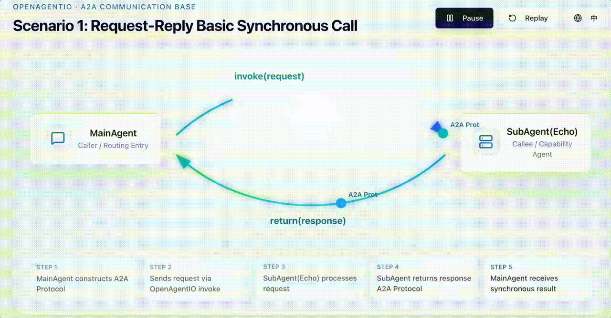
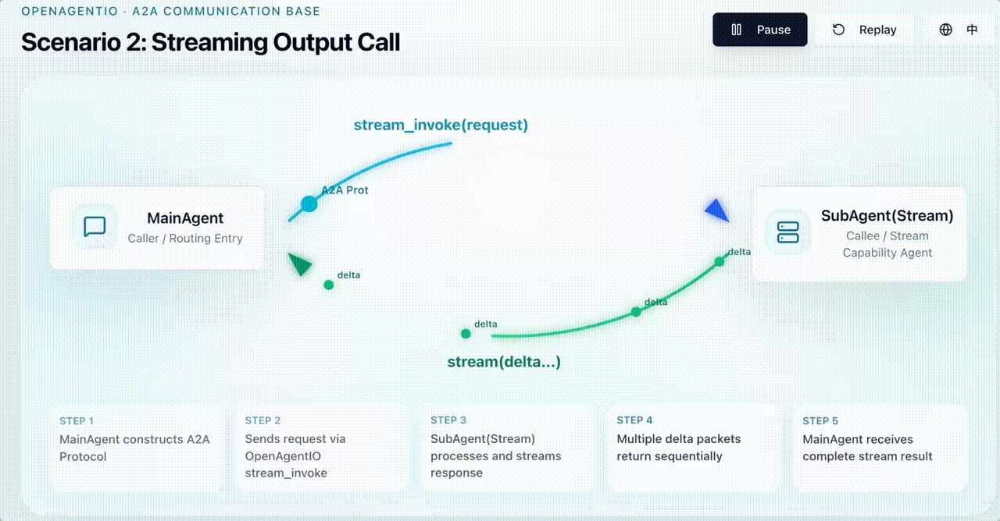
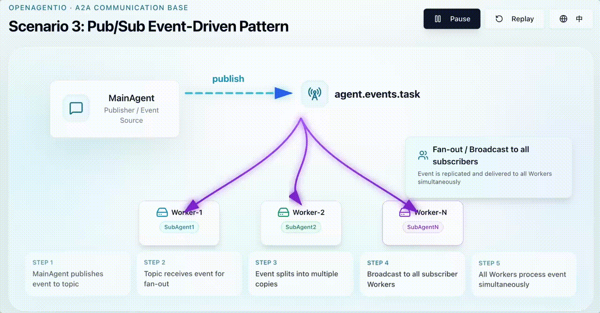
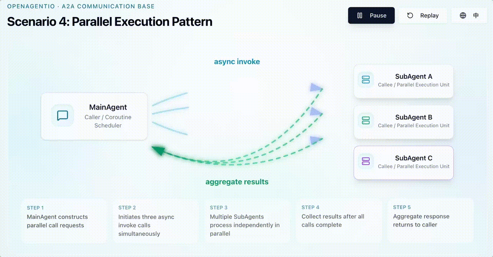
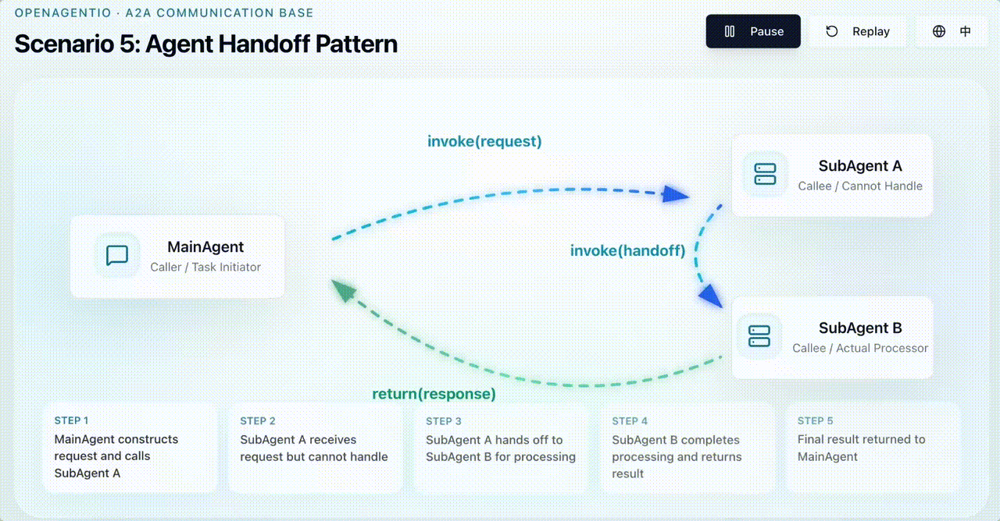
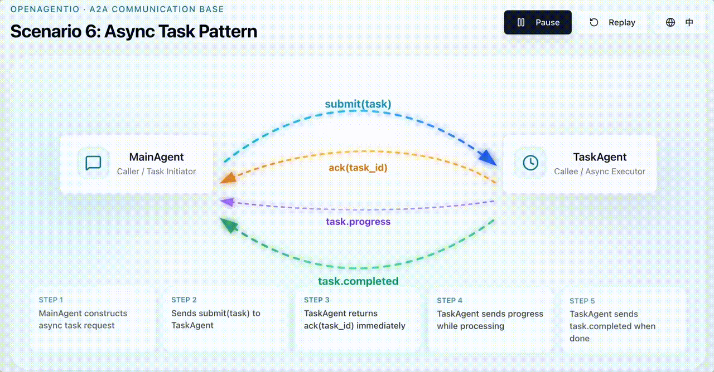

<div align="center">
<p align="center">


<h3 align="center">
OpenAgentIO
</h3>
<h5 align="center">
Runtime Communication Infrastructure for AI Agents
</h5>

<div align="center">Build distributed, streaming-native, event-driven multi-agent systems. </div></div>

---

OpenAgentIO is a lightweight runtime communication layer for AI agents.

It unifies complex Agent-to-Agent (A2A) communication patterns — including invoke, streaming, pub/sub, async tasks, session propagation, and trace propagation — into a single lightweight programming model.

OpenAgentIO is designed for distributed, event-driven, streaming-native multi-agent systems.

The project focuses on runtime communication and interoperability between agents, rather than planning, workflows, RAG, or prompt orchestration.


## Why OpenAgentIO?

Modern AI systems are no longer single agents.

They are:
- distributed
- event-driven
- streaming-native
- cross-runtime
- multi-agent

Yet most frameworks primarily focus on:
- prompting
- workflows
- tool calling

 


OpenAgentIO focuses on the runtime communication layer for AI agents.

It unifies complex Agent-to-Agent (A2A) communication patterns — including invoke, streaming, pub/sub, async tasks, session propagation, and trace propagation — into a single programming model.

Designed for distributed runtime collaboration, OpenAgentIO enables agents, workers, and runtimes to communicate consistently across different transports, languages, and execution environments.

## OpenAgentIO is NOT another Agent Framework

Agent frameworks and OpenAgentIO solve different layers of the AI runtime stack.

| Agent Frameworks             | OpenAgentIO                 |
| ---------------------------- | --------------------------- |
| Workflow orchestration       | Runtime communication       |
| Prompt orchestration         | Runtime interoperability    |
| Tool execution               | Distributed messaging       |
| Single runtime coordination  | Cross-runtime collaboration |
| Agent logic                  | Agent networking            |
| Task pipelines               | Streaming communication     |
| In-process workflows         | Distributed runtime systems |


## Problem Solved

Distributed Agent Communication Complexity

| Category | OpenAgentIO |
|---|---|
| Positioning | Agent Runtime Bus |
| Focus | Agent-to-Agent Communication |
| Protocols | invoke / stream / pubsub |
| Solves | Distributed A2A Runtime Communication |
| Architecture Layer | East-West Communication |
| Core Capabilities | Context / Session / Streaming |
| Envelope Model | Unified Envelope-Based Messaging |
| Context Propagation | Trace / Session Propagation |
| Runtime Support | Cross-Runtime Communication |
| Typical Scenarios | Multi-Agent Runtime |

## Communication Scenarios Coverage

| Scenario | Communication Pattern |
| --- | --- |
| ⭐️ Request-Reply | Synchronous Invocation |
| ⭐️ Streaming | Streaming Response |
| ⭐️ Pub/Sub | Event-Driven Messaging |
| ⭐️ Parallel Execution | Parallel Invocation |
| ⭐️ Agent Handoff | Context Transfer |
| ⭐️ Async Task | Asynchronous Task Processing |


## Scenario Demo

[]()
[]()
[]()
[]()
[]()
[]()


## Install

1. Go SDK (1.25+)
```sh
go get github.com/ModulationAI/openagentio
```

2. Python SDK (3.10+)
```sh
pip install openagentio
```


## Roadmap

> [!WARNING]
> OpenAgentIO is under active development and currently in the early 0.2 stage.
>
> The project is being rapidly refined around runtime communication APIs, protocol design, and cross-runtime interoperability.
>
> A more stable and officially usable 0.3 release is expected in early June 2026.

- v0.1: Go runtime, envelope schema, in-memory transport, NATS Core transport, invoke and streaming APIs.
- v0.2: HTTP/SSE adapter, Python SDK, session/trace propagation, OpenTelemetry bridge, retry / dead-letter middleware.
- v0.3: JetStream persistence and replay, auth middleware, metrics, TypeScript SDK.
- v1.0: stable cross-language protocol and production deployment guidance.

## License

License information has not been added yet.
